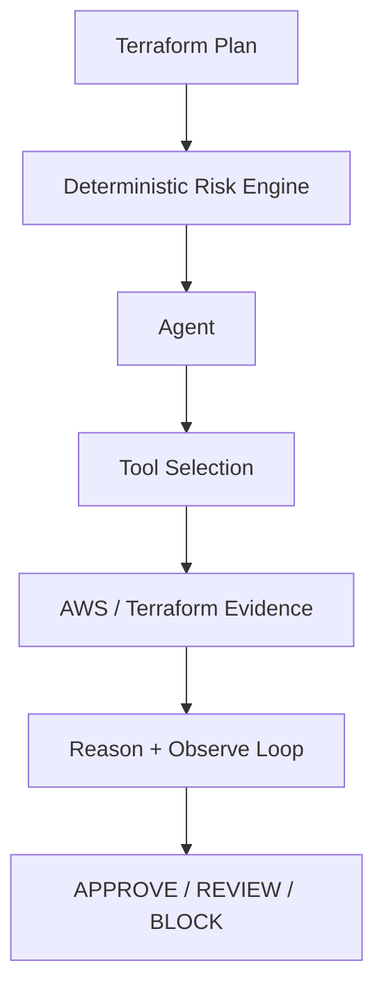
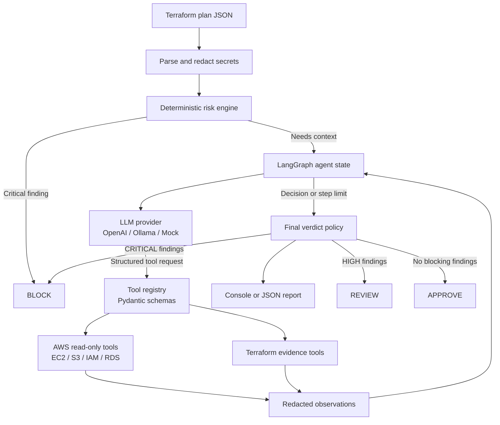

# Kestrel

Kestrel is an evidence-first AI infrastructure agent that reviews Terraform changes before they reach AWS. It combines straightforward security checks with a small, read-only investigation loop that can gather useful context from EC2, S3, IAM, RDS, and Terraform.

The aim is practical: catch risky infrastructure changes early, explain what needs attention, and give engineers a clear `APPROVE`, `REVIEW`, or `BLOCK` result before deployment. Kestrel can investigate, but it cannot change infrastructure or bypass its safety rules.

## What Problem Does It Solve?

Terraform tells us what is about to change, but a plan does not always tell us whether that change is safe in its wider AWS context. Kestrel addresses both sides of that review:

- **Known risks** are detected by deterministic rules that are easy to explain, test, and review.
- **Missing context** can be investigated by an AI agent using a small set of approved, read-only tools.

This makes Kestrel useful both locally and in CI/CD. It is an infrastructure review assistant, not an autonomous deployment system: there is no Terraform apply path, no write-capable AWS tool, and no arbitrary shell execution.

## Start Here

You can try Kestrel without an AWS account, API key, or network access:

```bash
python -m pip install -e .
kestrel analyze examples/safe-plan.json --mock --no-aws
kestrel analyze examples/risky-plan.json --mock --no-aws
```

The safe example returns `APPROVE`. The risky example returns `BLOCK` and shows the findings that led to that decision. Once the basic flow is clear, you can analyze a real Terraform plan or enable live AWS evidence.

## Key Guarantees

- **Deterministic first**: known-dangerous patterns are checked before any model call.
- **Limited investigation**: the LangGraph loop has a configurable maximum number of steps.
- **Explicit tools**: the model can use only tools that Kestrel registers and validates.
- **Read-only AWS access**: the supplied IAM policy grants inspection permissions only.
- **Safety rules stay in control**: a model response cannot downgrade a deterministic `CRITICAL` finding.
- **Secrets are handled carefully**: secret-like values are redacted before evidence is stored or sent to a provider.

## Architecture



### System Architecture



### How the Pieces Fit Together

| Component | Implementation | Responsibility |
|---|---|---|
| Terraform parsing | `terraform/` | Read plan JSON and normalize resource changes |
| Secret redaction | `terraform/evidence.py` | Remove sensitive values before they travel further |
| Risk checks | `risk/rules.py` | Apply explainable rules and create findings |
| Agent loop | `agent/planner.py` | Run the bounded LangGraph investigation cycle |
| Tool registry | `tools/` | Register tools and validate their inputs and outputs |
| AWS evidence | `aws/` | Call supported read-only boto3 APIs |
| Model providers | `llm/` | Support OpenAI-compatible, Ollama, and mock providers |
| Reporting | `reporting/` | Render terminal and JSON results |

## Features

- Terraform plan JSON parsing with changed attributes, replacements, actions, and recursive secret redaction.
- Deterministic rules for public SSH/RDP, wildcard IAM, S3 exposure, encryption removal, and destructive changes.
- Bounded structured agent loop with concise action rationales, no private chain-of-thought, and no arbitrary shell execution.
- Optional boto3 AWS evidence access for EC2, S3, IAM, and RDS using an explicit read-only IAM policy.
- OpenAI Chat Completions, OpenAI Responses/Codex, Anthropic Messages, Ollama, and offline mock providers.
- Rich terminal output, JSON reports, and a Typer CLI.

## Installation and Quick Start

Python 3.10+ is required. Terraform is needed only when generating a plan from Terraform configuration.

Optional prerequisites are an OpenAI-compatible API key or local Ollama installation, and AWS credentials with the read-only policy linked below when live evidence is needed. Kestrel can run fully offline with `--mock --no-aws`.

```bash
python -m pip install -e .
terraform show -json tfplan > plan.json
kestrel analyze plan.json
kestrel analyze plan.json --json --no-aws
kestrel analyze examples/risky-plan.json --mock
kestrel doctor
```


  PLAN[Terraform plan JSON] --> REDACT[Parse and redact secrets]
  REDACT --> RULES[Deterministic risk engine]
  RULES -->|Findings and plan summary| STATE[LangGraph agent state]
  STATE --> MODEL[LLM provider<br/>OpenAI / Codex / Anthropic / Ollama / Mock]
  MODEL -->|Structured decision| REGISTRY[Tool registry<br/>Validated read-only tools]
  REGISTRY --> AWS[AWS evidence<br/>EC2 / S3 / IAM / RDS]
  REGISTRY --> TF[Terraform evidence]
  AWS --> OBS[Redacted observation]
  TF --> OBS
  OBS --> STATE
  STATE -->|Final decision or step limit| POLICY[Authoritative verdict policy]
  RULES --> POLICY
  POLICY --> REPORT[Console or JSON report]
  POLICY --> APPROVE[APPROVE]
  POLICY --> REVIEW[REVIEW]
  POLICY --> BLOCK[BLOCK]
  POLICY -.->|CRITICAL always| BLOCK
# APPROVE

The agent may gather more evidence even when deterministic findings already exist. The final policy remains authoritative: critical findings always produce `BLOCK`, high findings produce `REVIEW` when no critical finding exists, and otherwise the result is `APPROVE`.

### How the Pieces Fit Together
# BLOCK
```

The risky example demonstrates findings such as public SSH access, public S3 access, and unsafe database configuration.

### 3. Analyze a real Terraform plan

Run these commands from the Terraform project that you want to review:

```bash
terraform plan -out=tfplan
terraform show -json tfplan > plan.json
kestrel analyze plan.json --mock --no-aws
```

This performs a plan-only review of a plan that was generated previously. AWS access and an external LLM are optional for this review step, but Terraform itself may have needed provider, module, state, or AWS access when the plan was created.

### 4. Choose an LLM provider

Set one provider before analyzing the plan:

```bash
# Anthropic
export KESTREL_LLM_PROVIDER=anthropic
export ANTHROPIC_API_KEY=your-api-key

# OpenAI Chat Completions
export KESTREL_LLM_PROVIDER=openai
export OPENAI_API_KEY=your-api-key

# Codex-compatible OpenAI Responses API
export KESTREL_LLM_PROVIDER=codex
export CODEX_API_KEY=your-api-key

# Local Ollama
export KESTREL_LLM_PROVIDER=ollama
```

Then run:

```bash
kestrel analyze plan.json --no-aws
```

Use `--mock --no-aws` when you want a completely offline run.

### 5. Add read-only AWS evidence

AWS inspection is optional. Configure a profile and region using the permissions in [iam/kestrel-readonly-policy.json](iam/kestrel-readonly-policy.json):

```bash
export AWS_PROFILE=kestrel-read-only
export AWS_REGION=us-east-1
kestrel analyze plan.json
```

Kestrel can inspect supported AWS context, but it cannot apply Terraform, modify AWS resources, or execute arbitrary commands.

### 6. Use the JSON result in CI/CD

```bash
kestrel analyze plan.json --mock --no-aws --json > verdict.json
```

The report includes the verdict, findings, confidence, remediation guidance, agent steps, and execution metadata. The verdicts mean:

- `APPROVE`: no blocking findings were identified.
- `REVIEW`: a high-severity issue needs human review.
- `BLOCK`: a critical issue should be fixed before deployment.

### OpenAI-Compatible API

Use the hosted OpenAI API or any server that exposes an OpenAI-compatible chat-completions endpoint:

```bash
export KESTREL_LLM_PROVIDER=openai
export OPENAI_API_KEY=your-api-key
export OPENAI_MODEL=gpt-4o-mini
kestrel analyze plan.json
```

`OPENAI_BASE_URL` defaults to `https://api.openai.com/v1`. Set it to a local or other compatible server, such as `http://localhost:8000/v1`; the API key may be omitted for servers that do not require authentication. Keep API keys out of plan files and source control.

### Anthropic

Kestrel supports Anthropic's Messages API:

```bash
export KESTREL_LLM_PROVIDER=anthropic
export ANTHROPIC_API_KEY=your-api-key
export ANTHROPIC_MODEL=claude-3-5-haiku-latest
kestrel analyze plan.json
```

The adapter uses `POST /v1/messages` and converts Anthropic's text response into Kestrel's structured `Decision` contract.

### Codex and OpenAI Responses API

For Codex-compatible OpenAI models, use the Responses API adapter:

```bash
export KESTREL_LLM_PROVIDER=codex
export CODEX_API_KEY=your-api-key
export CODEX_MODEL=gpt-5-codex
kestrel analyze plan.json
```

The adapter uses `POST /v1/responses`. `CODEX_BASE_URL` can point to a compatible gateway; when it is not set, Kestrel falls back to `OPENAI_BASE_URL` and then `https://api.openai.com/v1`.

### Provider Support

| Provider value | API | Required configuration |
|---|---|---|
| `mock` | Offline deterministic demo | None |
| `openai` | OpenAI Chat Completions | `OPENAI_API_KEY`, `OPENAI_MODEL` |
| `codex` | OpenAI Responses API | `CODEX_API_KEY`, `CODEX_MODEL` |
| `anthropic` | Anthropic Messages API | `ANTHROPIC_API_KEY`, `ANTHROPIC_MODEL` |
| `ollama` | Ollama local chat API | `OLLAMA_BASE_URL`, `OLLAMA_MODEL` |

All providers return the same structured decision format. Provider-specific model capabilities and endpoint compatibility still apply, so test your selected model with the offline suite and a representative plan before using it in CI.

## Agent Workflow

Kestrel follows a predictable sequence on every run:

1. Read the Terraform plan and redact secret-like values.
2. Run deterministic risk checks before making any model call.
3. Give the provider a summary of the plan, findings, and available tools.
4. Validate the provider's decision and, when requested, run a read-only tool.
5. Add the tool result to the investigation and repeat until the agent finishes or the step limit is reached.
6. Apply the final verdict policy. Critical findings always result in `BLOCK`.

### Detailed Workflow

```text
Phase 1: Input and deterministic analysis
  Terraform plan JSON
    -> parse resource changes and actions
    -> recursively redact secret-like fields
    -> evaluate local security rules
    -> create findings with severity and confidence

Phase 2: Bounded agent investigation
  redacted plan + findings + tool definitions
    -> provider selects an allowed tool or returns a final decision
    -> Pydantic validates the tool name and arguments
    -> read-only AWS/Terraform tool executes
    -> result is redacted and appended to graph state
    -> repeat until final decision or step limit

Phase 3: Authoritative policy and reporting
  deterministic findings + agent observations
    -> CRITICAL means BLOCK
    -> HIGH means REVIEW when no CRITICAL exists
    -> otherwise APPROVE
    -> render console output or JSON report
```

The model is used for investigation and prioritization. It does not receive AWS credentials, permissions, or arbitrary execution. This gives Kestrel the useful part of agentic reasoning while keeping the important safety decisions in code that can be reviewed and tested.

## AWS Read-Only Setup

AWS access is optional. Use `--no-aws` for a plan-only review, or configure `AWS_PROFILE` and `AWS_REGION` when live context is useful. You can also pass `--aws-profile` and `--region` directly.

For live inspection, attach [iam/kestrel-readonly-policy.json](iam/kestrel-readonly-policy.json) to a dedicated investigation role. The policy grants inspection actions only, including caller identity, EC2 descriptions, S3 configuration reads, IAM role inspection, RDS descriptions, and CloudWatch alarm descriptions. Kestrel has no apply path, write API, or arbitrary command tool.

## JSON Output

`--json` emits `verdict`, `summary`, `findings`, `agent_steps`, and `metadata`. Secret-like values become `[REDACTED]` before evidence is stored or sent to a provider.

The verdict is intentionally easy to consume in automation:

- `APPROVE`: no blocking findings were identified.
- `REVIEW`: a high-severity issue needs a person to make the call.
- `BLOCK`: at least one critical issue should be fixed before deployment.

## Limitations and Scope

Kestrel is a focused V1 security review agent, not a complete AWS security platform:

- Coverage is strongest for Terraform plan changes and supported EC2, S3, IAM, and RDS inspection paths.
- It does not yet provide comprehensive Security Hub coverage, IAM MFA analysis, stale credential detection, trust-policy analysis, public snapshot checks, or full network topology discovery.
- Live AWS evidence depends on correct credentials, permissions, region, and resource identifiers.
- LLM providers can be unavailable, return malformed output, or provide incomplete recommendations. Deterministic critical findings remain authoritative.
- Kestrel does not replace Terraform validation, policy-as-code tooling, penetration testing, cloud monitoring, or human review for high-impact changes.
- The read-only IAM policy uses broad resource scoping where AWS inspection APIs require it; access should still be isolated to a dedicated role or account.

These limitations are deliberate: V1 prioritizes bounded behavior, explainability, and safety over pretending to provide complete cloud governance coverage.

## Project Structure

`src/kestrel` separates Terraform parsing, deterministic risk analysis, agent state and prompts, tool capabilities, AWS access, LLM adapters, and reporting. Examples, tests, IAM policy, security documentation, and GitHub templates live at the repository root.

Most contributors will start in these files:

- `src/kestrel/cli.py`: connects the pieces and defines the command-line interface.
- `src/kestrel/risk/rules.py`: adds or changes deterministic security checks.
- `src/kestrel/agent/planner.py`: controls the LangGraph investigation loop.
- `src/kestrel/tools/registry.py`: enforces which tools the agent is allowed to use.
- `src/kestrel/aws/client.py`: contains read-only AWS API wrappers.
- `tests/`: shows the expected behavior and is the best place to add regression coverage.

## Development and Testing

```bash
pytest
ruff check .
mypy src
```

See [docs/architecture.md](docs/architecture.md), [docs/agent-loop.md](docs/agent-loop.md), [docs/threat-model.md](docs/threat-model.md), and [SECURITY.md](SECURITY.md).

## Roadmap

V2 may add CloudLens architecture discovery across Route53, ALB, EC2/Auto Scaling, and RDS. V3 may combine change and architecture reasoning for confirmed outage risk. V4 may add GitHub pull-request reviews. These capabilities are intentionally not part of V1.

## Summary

**Kestrel is a production-oriented, evidence-first AI infrastructure security agent for Terraform.** I built it with Python, LangGraph, Pydantic, boto3, and typed provider adapters to review infrastructure changes before deployment.

The project combines a deterministic risk engine with a bounded tool-using agent. Deterministic controls detect high-confidence issues such as world-open SSH, public S3 access, wildcard IAM permissions, missing encryption, and destructive changes. When more context is useful, the LangGraph agent selects from strictly read-only AWS tools for EC2, S3, IAM, and RDS. Secrets are redacted before provider calls, tool inputs and outputs are schema-validated, and critical findings cannot be overridden by the model.

This architecture demonstrates a practical approach to AI agents in security: use the model for evidence-driven investigation and prioritization, while keeping authorization, capabilities, and safety invariants in deterministic code.

## Contributing and License

See [CONTRIBUTING.md](CONTRIBUTING.md). Kestrel is released under the Apache License 2.0; see [LICENSE](LICENSE).
