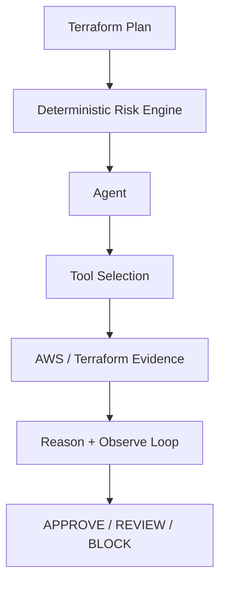
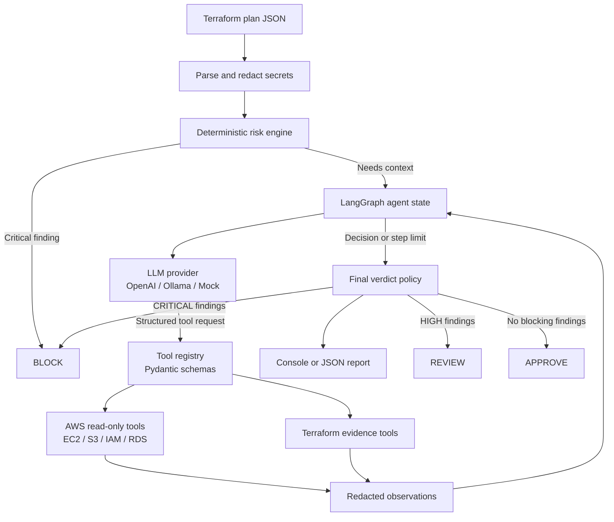

# Kestrel

Kestrel is an evidence-first AI infrastructure agent that reviews Terraform changes, investigates AWS architecture using strictly read-only tools, and produces security and reliability recommendations before infrastructure is deployed.

It is an AI agent, not simply an LLM wrapper. Kestrel observes a redacted plan, chooses from a bounded registry of structured tools, observes their results, and repeats until it has enough evidence for an `APPROVE`, `REVIEW`, or `BLOCK` verdict. Deterministic safeguards remain outside the model and cannot be overridden.

## Why Kestrel?

Terraform describes the intended infrastructure change, but a plan may not contain enough context to assess the real security and operational impact. Kestrel separates that problem into two parts:

- **Objective risk detection** is handled by deterministic rules that are explainable, testable, and independent of model availability.
- **Context gathering** is handled by a bounded AI agent that can request additional evidence through approved, read-only tools.

The result is an infrastructure review assistant designed for CI/CD and human review, not an autonomous deployment system. Kestrel has no Terraform apply path, no write-capable AWS tools, and no arbitrary shell execution.

## Key Guarantees

- **Deterministic first**: known-dangerous patterns are evaluated before any model call.
- **Bounded autonomy**: the LangGraph loop is limited by `KESTREL_MAX_AGENT_STEPS`.
- **Capability boundaries**: the model can select only registered tools with validated schemas.
- **Least privilege**: AWS access uses a dedicated read-only IAM policy.
- **Fail-closed decisions**: an LLM response cannot downgrade a deterministic `CRITICAL` finding.
- **Evidence minimization**: secret-like values are redacted before storage or provider calls.

## Architecture



### System Architecture



### Core Components

| Component | Implementation | Responsibility |
|---|---|---|
| Terraform boundary | `terraform/` | Parse plan JSON and normalize resource changes |
| Redaction boundary | `terraform/evidence.py` | Remove secret-like values before evidence or provider calls |
| Risk engine | `risk/rules.py` | Apply explainable security rules and produce findings |
| Agent orchestration | `agent/planner.py` | Run the bounded LangGraph observe-decide-act loop |
| Capability boundary | `tools/` | Register tools and validate input/output contracts |
| AWS evidence | `aws/` | Call only supported read-only boto3 APIs |
| Provider adapters | `llm/` | Support OpenAI-compatible, Ollama, and mock providers |
| Reporting | `reporting/` | Render console and machine-readable JSON results |

## Features

- Terraform plan JSON parsing with changed attributes, replacements, actions, and recursive secret redaction.
- Deterministic rules for public SSH/RDP, wildcard IAM, S3 exposure, encryption removal, and destructive changes.
- Bounded structured agent loop with concise action rationales, no private chain-of-thought, and no arbitrary shell execution.
- Optional boto3 AWS evidence access for EC2, S3, IAM, and RDS using an explicit read-only IAM policy.
- Offline mock provider, Rich terminal output, JSON reports, and a Typer CLI.

## Installation and Quick Start

Python 3.10+ is required. Terraform is needed only when generating a plan from Terraform configuration.

Optional prerequisites are an OpenAI-compatible API key or local Ollama installation, and AWS credentials with the read-only policy linked below when live evidence is needed. Kestrel can run fully offline with `--mock --no-aws`.

```bash
python -m pip install -e .
terraform show -json tfplan > plan.json
kestrel analyze plan.json
kestrel analyze plan.json --json --no-aws
kestrel analyze examples/risky-plan.json --mock
kestrel doctor
```

The mock demo requires no API key, AWS account, or network access. The safe example produces `APPROVE`; the risky example produces `BLOCK`.

### OpenAI-Compatible API

Use the hosted OpenAI API or any server that exposes an OpenAI-compatible chat-completions endpoint:

```bash
export KESTREL_LLM_PROVIDER=openai
export OPENAI_API_KEY=your-api-key
export OPENAI_MODEL=gpt-4o-mini
kestrel analyze plan.json
```

`OPENAI_BASE_URL` defaults to `https://api.openai.com/v1`. Set it to a local or other compatible server, such as `http://localhost:8000/v1`; the API key may be omitted for servers that do not require authentication. Keep API keys out of plan files and source control.

## Agent Workflow

1. Parse and redact the plan.
2. Run deterministic risk rules before any model call.
3. Give the provider summarized context and registered tool definitions.
4. Validate decisions, execute only read-only tools, and append observations.
5. Stop at a final decision or `KESTREL_MAX_AGENT_STEPS` (default 8).
6. Apply authoritative verdict policy: critical findings always block.

### Detailed Workflow

```text
Phase 1: Input and deterministic analysis
  Terraform plan JSON
    -> parse resource changes and actions
    -> recursively redact secret-like fields
    -> evaluate local security rules
    -> create findings with severity and confidence

Phase 2: Bounded agent investigation
  redacted plan + findings + tool definitions
    -> provider selects an allowed tool or returns a final decision
    -> Pydantic validates the tool name and arguments
    -> read-only AWS/Terraform tool executes
    -> result is redacted and appended to graph state
    -> repeat until final decision or step limit

Phase 3: Authoritative policy and reporting
  deterministic findings + agent observations
    -> CRITICAL means BLOCK
    -> HIGH means REVIEW when no CRITICAL exists
    -> otherwise APPROVE
    -> render console output or JSON report
```

The model is used for investigation and prioritization. It is not trusted with permissions, execution, or the final safety invariant. This lets Kestrel benefit from agentic reasoning while keeping the security boundary in code that can be reviewed and tested.

## AWS Read-Only Setup

Configure `AWS_PROFILE` and `AWS_REGION`, or pass `--aws-profile` and `--region`. Attach [iam/kestrel-readonly-policy.json](iam/kestrel-readonly-policy.json) to a dedicated investigation role. The custom policy grants only describe, alarm, and caller-identity actions. Kestrel has no apply path, write API, or arbitrary command tool.

## JSON Output

`--json` emits `verdict`, `summary`, `findings`, `agent_steps`, and `metadata`. Secret-like values become `[REDACTED]` before evidence is stored or sent to a provider.

## Limitations and Scope

Kestrel is a focused V1 security review agent, not a complete AWS security platform:

- Coverage is strongest for Terraform plan changes and supported EC2, S3, IAM, and RDS inspection paths.
- It does not yet provide comprehensive Security Hub coverage, IAM MFA analysis, stale credential detection, trust-policy analysis, public snapshot checks, or full network topology discovery.
- Live AWS evidence depends on correct credentials, permissions, region, and resource identifiers.
- LLM providers can be unavailable, return malformed output, or provide incomplete recommendations. Deterministic critical findings remain authoritative.
- Kestrel does not replace Terraform validation, policy-as-code tooling, penetration testing, cloud monitoring, or human review for high-impact changes.
- The read-only IAM policy uses broad resource scoping where AWS inspection APIs require it; access should still be isolated to a dedicated role or account.

These limitations are deliberate: V1 prioritizes bounded behavior, explainability, and safety over pretending to provide complete cloud governance coverage.

## Project Structure

`src/kestrel` separates Terraform parsing, deterministic risk analysis, agent state and prompts, tool capabilities, AWS access, LLM adapters, and reporting. Examples, tests, IAM policy, security documentation, and GitHub templates live at the repository root.

## Development and Testing

```bash
pytest
ruff check .
mypy src
```

See [docs/architecture.md](docs/architecture.md), [docs/agent-loop.md](docs/agent-loop.md), [docs/threat-model.md](docs/threat-model.md), and [SECURITY.md](SECURITY.md).

## Roadmap

V2 may add CloudLens architecture discovery across Route53, ALB, EC2/Auto Scaling, and RDS. V3 may combine change and architecture reasoning for confirmed outage risk. V4 may add GitHub pull-request reviews. These capabilities are intentionally not part of V1.

## Summary

**Kestrel is a production-oriented, evidence-first AI infrastructure security agent for Terraform.** I built it with Python, LangGraph, Pydantic, boto3, and typed provider adapters to review infrastructure changes before deployment.

The project combines a deterministic risk engine with a bounded tool-using agent. Deterministic controls detect high-confidence issues such as world-open SSH, public S3 access, wildcard IAM permissions, missing encryption, and destructive changes. When more context is useful, the LangGraph agent selects from strictly read-only AWS tools for EC2, S3, IAM, and RDS. Secrets are redacted before provider calls, tool inputs and outputs are schema-validated, and critical findings cannot be overridden by the model.

This architecture demonstrates a practical approach to AI agents in security: use the model for evidence-driven investigation and prioritization, while keeping authorization, capabilities, and safety invariants in deterministic code.

## Contributing and License

See [CONTRIBUTING.md](CONTRIBUTING.md). Kestrel is released under the Apache License 2.0; see [LICENSE](LICENSE).
