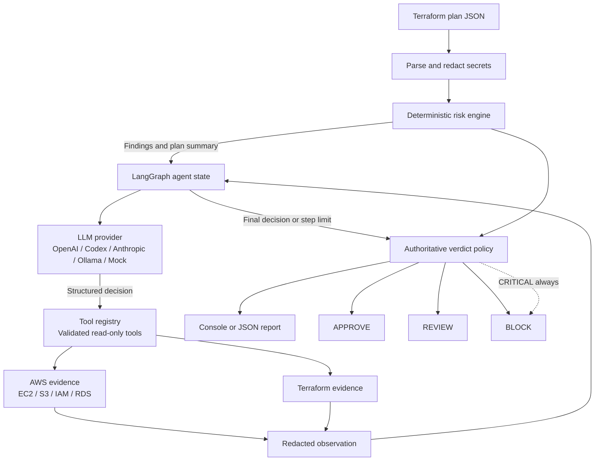

# Kestrel

Kestrel is an evidence-first AI infrastructure security agent that reviews Terraform changes before they reach AWS. It combines deterministic security checks with a bounded investigation loop that can gather additional, read-only context from Terraform and AWS.

The goal is practical: catch risky infrastructure changes early, explain what needs attention, and return a clear `APPROVE`, `REVIEW`, or `BLOCK` decision. Kestrel can investigate, but it cannot change infrastructure or bypass its safety rules.

## What Problem Does It Solve?

Terraform shows what is about to change, but a plan does not always provide enough context to understand the security and operational impact. Kestrel handles both sides of that review:

- **Known risks** are detected by deterministic rules that are explainable and testable.
- **Missing context** can be investigated by an AI agent using approved, read-only tools.

This makes Kestrel useful for local reviews and CI/CD pipelines. It is an infrastructure review assistant, not an autonomous deployment system: there is no Terraform apply path, no write-capable AWS tool, and no arbitrary shell execution.

## Start Here

Try the included examples without an AWS account, API key, or network access:

```bash
python -m pip install -e .
kestrel analyze examples/safe-plan.json --mock --no-aws
# APPROVE
kestrel analyze examples/risky-plan.json --mock --no-aws
# BLOCK
```

The risky example demonstrates findings such as public SSH access, public S3 access, and unsafe database configuration.

## Architecture



The agent may gather more evidence even when deterministic findings already exist. The final policy remains authoritative: critical findings always produce `BLOCK`, high findings produce `REVIEW` when no critical finding exists, and otherwise the result is `APPROVE`.

### How the Pieces Fit Together

| Component | Location | Responsibility |
|---|---|---|
| Terraform parsing | `terraform/` | Read plan JSON and normalize resource changes |
| Secret redaction | `terraform/evidence.py` | Remove sensitive values before they travel further |
| Risk checks | `risk/rules.py` | Apply explainable rules and create findings |
| Agent loop | `agent/planner.py` | Run the bounded LangGraph investigation cycle |
| Tool registry | `tools/` | Register tools and validate inputs and outputs |
| AWS evidence | `aws/` | Call supported read-only boto3 APIs |
| Model providers | `llm/` | Connect supported providers to one decision contract |
| Reporting | `reporting/` | Render terminal and JSON results |

## What Kestrel Checks

The V1 deterministic engine includes checks for:

- Public SSH and RDP ingress, public database ports, and unrestricted ports
- EC2 public IP assignment, IMDSv1, and disabled monitoring
- S3 public access, public ACLs, missing versioning, and destructive lifecycle settings
- RDS public accessibility, missing encryption, no backups, and missing final snapshots
- IAM wildcard actions and resources
- Encryption removal, root-volume deletion, and destructive resource changes

Findings include a rule ID, severity, confidence percentage, affected resource, explanation, and remediation guidance.

| Finding state | Verdict |
|---|---|
| One or more `CRITICAL` findings | `BLOCK` |
| No critical findings, but one or more `HIGH` findings | `REVIEW` |
| No blocking findings | `APPROVE` |

## How Kestrel Is an AI Agent

Kestrel is not a one-shot LLM summary. It follows a bounded observe, decide, act, and observe cycle:

```text
Observe the redacted plan and deterministic findings
  -> decide whether more evidence is needed
  -> select an approved structured tool
  -> execute the read-only tool
  -> observe its redacted result
  -> repeat until done or the step limit is reached
```

LangGraph stores the current observations, round count, and final state. Each provider returns a structured decision. The model can investigate and prioritize, but it does not receive AWS credentials or control the final safety policy.

## Installation and Usage

### Prerequisites

- Python 3.10 or newer
- Terraform only when generating a plan from Terraform configuration
- An LLM API key or Ollama only when using a real model
- AWS credentials only when live AWS evidence is needed

### Install

```bash
git clone https://github.com/sushmitha-ramesh/kestrel.git
cd kestrel
python -m venv .venv
source .venv/bin/activate
python -m pip install -e .
```

### Review a Real Terraform Plan

Run this from the Terraform project you want to review:

```bash
terraform plan -out=tfplan
terraform show -json tfplan > plan.json
kestrel analyze plan.json --mock --no-aws
```

Kestrel's offline mode applies to reviewing an existing plan. Generating a new Terraform plan may still need internet or AWS access when providers or modules must be downloaded, data sources read AWS, credentials are validated, remote state is accessed, or infrastructure is refreshed. A previously generated plan can be exported and reviewed offline:

```bash
terraform show -json saved-plan.tfplan > plan.json
kestrel analyze plan.json --mock --no-aws
```

### Choose an LLM Provider

Set one provider before running `kestrel analyze`:

```bash
# Anthropic Messages API
export KESTREL_LLM_PROVIDER=anthropic
export ANTHROPIC_API_KEY=your-api-key
export ANTHROPIC_MODEL=claude-3-5-haiku-latest

# OpenAI Chat Completions
export KESTREL_LLM_PROVIDER=openai
export OPENAI_API_KEY=your-api-key
export OPENAI_MODEL=gpt-4o-mini

# Codex-compatible OpenAI Responses API
export KESTREL_LLM_PROVIDER=codex
export CODEX_API_KEY=your-api-key
export CODEX_MODEL=gpt-5-codex

# Local Ollama
export KESTREL_LLM_PROVIDER=ollama
export OLLAMA_MODEL=qwen2.5:7b
```

Then run:

```bash
kestrel analyze plan.json --no-aws
```

The `mock` provider is the easiest way to test without a network or API key.

### Add Read-Only AWS Evidence

AWS access is optional. Configure a profile and region using the policy in [iam/kestrel-readonly-policy.json](iam/kestrel-readonly-policy.json):

```bash
export AWS_PROFILE=kestrel-read-only
export AWS_REGION=us-east-1
kestrel analyze plan.json
```

Kestrel uses supported read-only inspection calls only. It cannot apply Terraform, modify AWS resources, or execute arbitrary commands.

### Use JSON in CI/CD

```bash
kestrel analyze plan.json --mock --no-aws --json > verdict.json
```

The report includes the verdict, findings, confidence, remediation guidance, agent steps, and execution metadata.

## Provider Support

| Provider value | API | Required configuration |
|---|---|---|
| `mock` | Offline test provider | None |
| `openai` | OpenAI Chat Completions | `OPENAI_API_KEY`, `OPENAI_MODEL` |
| `codex` | OpenAI Responses API | `CODEX_API_KEY`, `CODEX_MODEL` |
| `anthropic` | Anthropic Messages API | `ANTHROPIC_API_KEY`, `ANTHROPIC_MODEL` |
| `ollama` | Ollama local chat API | `OLLAMA_BASE_URL`, `OLLAMA_MODEL` |

All providers map their responses to the same structured Kestrel decision format. Endpoint and model capabilities still vary by provider, so test a representative plan before using a provider in CI.

## Limitations and Scope

Kestrel is a focused V1 review agent, not a complete AWS security platform:

- Coverage is strongest for Terraform changes and supported EC2, S3, IAM, and RDS inspection paths.
- It does not yet provide comprehensive Security Hub coverage, IAM MFA analysis, stale credential detection, trust-policy analysis, public snapshot checks, or full network topology discovery.
- Live AWS evidence depends on correct credentials, permissions, region, and resource identifiers.
- LLM providers can be unavailable, return malformed output, or provide incomplete recommendations. Deterministic critical findings remain authoritative.
- Kestrel does not replace Terraform validation, policy-as-code tooling, penetration testing, cloud monitoring, or human review for high-impact changes.

These limitations are deliberate: V1 prioritizes bounded behavior, explainability, and safety over pretending to provide complete cloud governance coverage.

## Project Structure

```text
src/kestrel/
├── agent/       LangGraph orchestration, state, and prompts
├── aws/         Read-only boto3 clients and typed AWS models
├── llm/         OpenAI, Codex, Anthropic, Ollama, and mock providers
├── reporting/   Rich console and JSON report renderers
├── risk/        Deterministic rules and findings
├── terraform/   Plan parsing and secret-safe evidence extraction
├── tools/       Typed tool contracts, registry, and AWS tools
├── config.py    Environment and runtime configuration
└── cli.py       Typer command-line interface
```

Most contributors will start in `cli.py`, `risk/rules.py`, `agent/planner.py`, `tools/registry.py`, `aws/client.py`, and `tests/`.

## Development and Testing

```bash
pytest
ruff check .
mypy src
```

The tests cover Terraform parsing, secret redaction, deterministic rules, allowlisted ingress, typed AWS clients and tools, provider behavior, LangGraph orchestration, and end-to-end safe/risky plan analysis.

See [docs/architecture.md](docs/architecture.md), [docs/agent-loop.md](docs/agent-loop.md), [docs/threat-model.md](docs/threat-model.md), [SECURITY.md](SECURITY.md), and [CONTRIBUTING.md](CONTRIBUTING.md).

## Roadmap

Potential follow-on work includes public AMI and snapshot detection, deeper S3 and RDS posture checks, IAM trust-policy analysis, subnet and route-table topology, drift detection, cost impact analysis, and GitHub pull-request integration.

## License

Kestrel is released under the Apache License 2.0. See [LICENSE](LICENSE).
